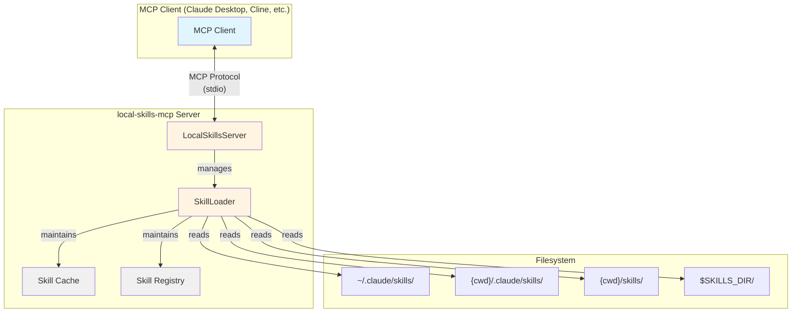
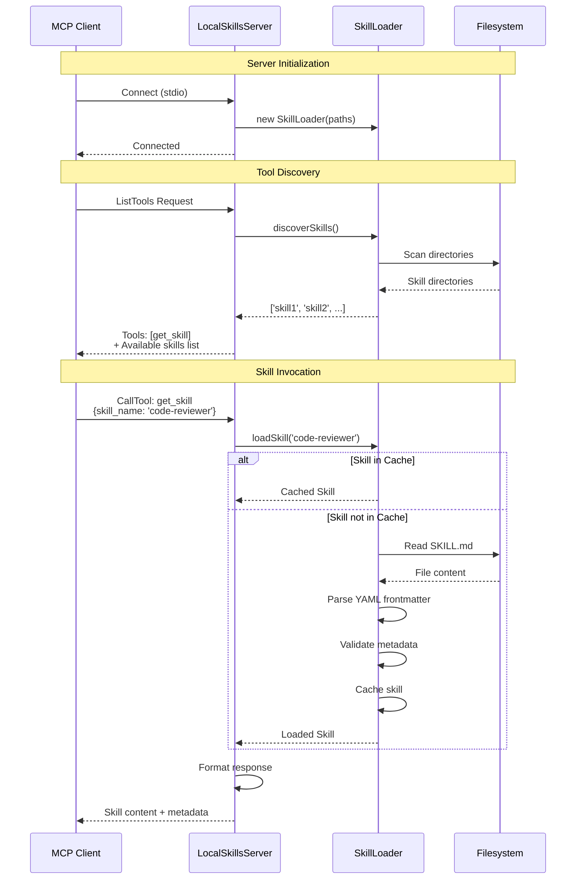
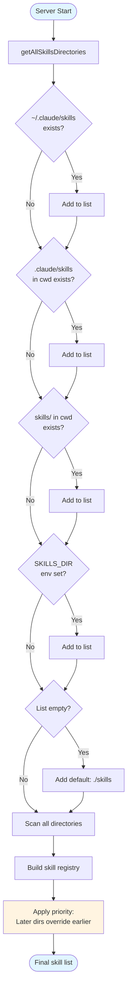
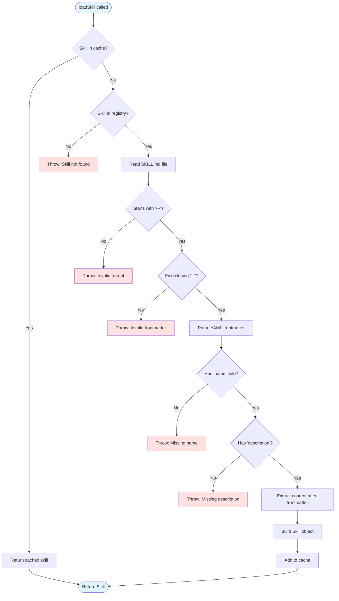
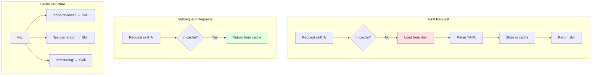
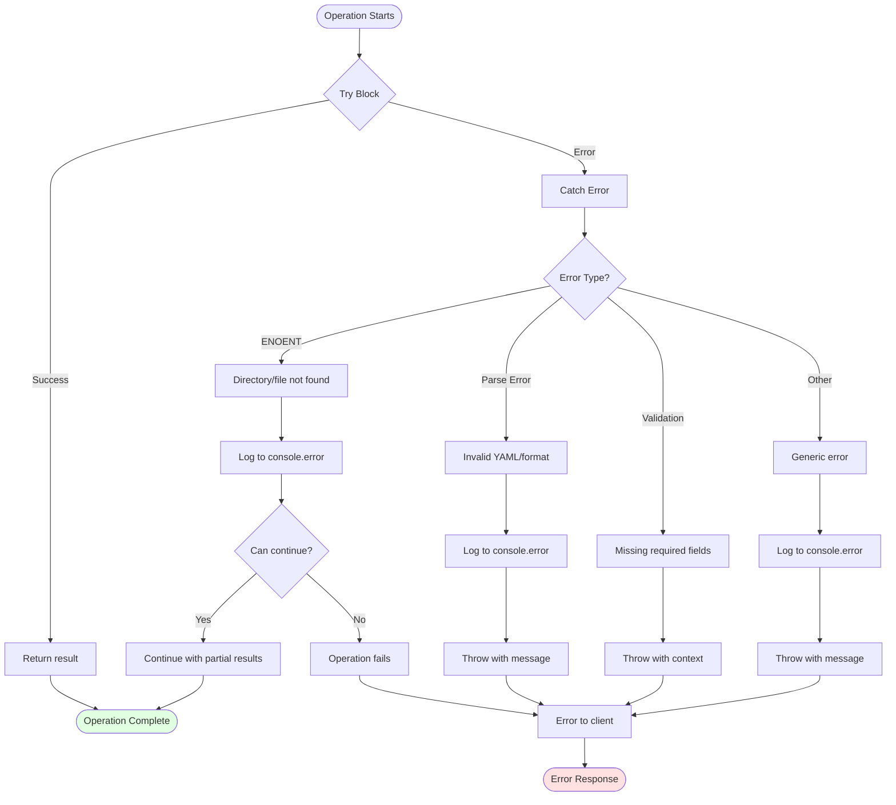

# Architecture Documentation

This document provides a comprehensive overview of the local-skills-mcp system architecture, including system design, component interactions, data flow, and key implementation details.

## Table of Contents

- [System Overview](#system-overview)
- [Architecture Diagrams](#architecture-diagrams)
  - [High-Level System Architecture](#high-level-system-architecture)
  - [MCP Protocol Flow](#mcp-protocol-flow)
  - [Directory Aggregation Strategy](#directory-aggregation-strategy)
  - [Skill Loading Sequence](#skill-loading-sequence)
  - [Caching Mechanism](#caching-mechanism)
  - [Error Handling Flow](#error-handling-flow)
- [Component Details](#component-details)
- [Design Decisions](#design-decisions)
- [Performance Considerations](#performance-considerations)

---

## System Overview

local-skills-mcp is an MCP (Model Context Protocol) server that provides AI assistants with access to skill prompts stored on the local filesystem. The system is designed around three core principles:

1. **Lazy Loading**: Only skill names are initially visible; full content loads on-demand
2. **Directory Aggregation**: Multiple skill directories can be monitored simultaneously
3. **Caching**: Loaded skills are cached to minimize file I/O

The server acts as a bridge between MCP clients (like Claude Desktop) and the local filesystem, discovering and serving skills from multiple configured directories.

---

## Architecture Diagrams

### High-Level System Architecture

This diagram shows the overall system components and their relationships.



**Key Components:**

- **MCP Client**: Any MCP-compatible client (Claude Desktop, Cline, custom agents)
- **LocalSkillsServer**: Main server handling MCP protocol communication
- **SkillLoader**: Core logic for discovering and loading skills
- **Skill Cache**: In-memory cache of loaded skill content
- **Skill Registry**: Lightweight index of available skills
- **Filesystem**: Multiple directories containing skill definitions

---

### MCP Protocol Flow

This sequence diagram shows how the MCP protocol communication works between client and server.



**Protocol Phases:**

1. **Initialization**: Client connects to server via stdio
2. **Tool Discovery**: Client requests available tools, server responds with skill list
3. **Skill Invocation**: Client requests specific skill, server loads and returns it

---

### Directory Aggregation Strategy

This diagram illustrates how skills from multiple directories are discovered and prioritized.



**Priority Rules:**

- Directories are scanned in order: `~/.claude/skills`, `.claude/skills`, `./skills`, `$SKILLS_DIR`
- For duplicate skill names, **later directories take precedence**
- This allows per-project skill overrides
- At least one directory is always included (default: `./skills`)

**Example:**

```
~/.claude/skills/code-reviewer/     ← Lower priority
  SKILL.md (name: "Basic Reviewer")

./skills/code-reviewer/             ← Higher priority (overrides)
  SKILL.md (name: "Advanced Reviewer")

Result: "Advanced Reviewer" is used
```

---

### Skill Loading Sequence

Detailed flow of loading a skill, including caching and error handling.



**Validation Requirements:**

1. File must start with `---\n`
2. Frontmatter must end with `\n---\n`
3. YAML must contain `name` field
4. YAML must contain `description` field
5. Content exists after frontmatter

---

### Caching Mechanism

How the caching system works to optimize performance.



**Cache Characteristics:**

- **Type**: In-memory Map<string, Skill>
- **Lifetime**: Process lifetime (cleared on server restart)
- **Invalidation**: No automatic invalidation (requires restart)
- **Key**: Skill name (string)
- **Value**: Complete Skill object with content

**Performance Impact:**

- First load: ~1-5ms (disk I/O + parsing)
- Cached load: ~0.01ms (memory lookup)
- 100-500x speedup for repeated access

---

### Error Handling Flow

How errors are caught and reported throughout the system.



**Error Categories:**

1. **Recoverable Errors** (logged, operation continues):
   - Directory doesn't exist during discovery
   - Individual skill has malformed SKILL.md
   - Permission issues on specific files

2. **Non-Recoverable Errors** (thrown to client):
   - Requested skill not found
   - Invalid SKILL.md format for requested skill
   - Missing required YAML fields
   - File read failures

**Error Reporting:**

- Server errors logged to stderr
- Client receives error in MCP response format
- Error messages include context and suggestions

---

## Component Details

### LocalSkillsServer

**Responsibilities:**
- Initialize and manage MCP server
- Handle MCP protocol requests
- Coordinate with SkillLoader
- Format responses for clients
- Handle graceful shutdown

**Key Methods:**
- `setupHandlers()`: Register MCP request handlers
- `setupErrorHandling()`: Configure error handlers and signals
- `handleGetSkill()`: Process get_skill tool calls
- `run()`: Start server and connect transport

**State:**
- `server`: MCP Server instance
- `skillLoader`: SkillLoader instance

### SkillLoader

**Responsibilities:**
- Discover skills across multiple directories
- Load and parse SKILL.md files
- Maintain skill cache and registry
- Validate skill format and metadata

**Key Methods:**
- `discoverSkills()`: Scan directories and build registry
- `loadSkill()`: Load specific skill with caching
- `parseSkillFile()`: Parse YAML frontmatter and content
- `getSkillMetadata()`: Get metadata without full content
- `getSkillsPaths()`: Return configured directories

**State:**
- `skillsPaths`: Array of directory paths
- `skillCache`: Map of loaded skills
- `skillRegistry`: Map of skill locations

### Data Flow

```
Client Request
    ↓
MCP Protocol (stdio)
    ↓
LocalSkillsServer
    ↓
Request Handler
    ↓
SkillLoader.loadSkill()
    ↓
Cache Check → [Hit: Return] [Miss: Continue]
    ↓
Filesystem Read
    ↓
YAML Parse + Validate
    ↓
Cache Store
    ↓
Return to Server
    ↓
Format Response
    ↓
MCP Protocol (stdio)
    ↓
Client Response
```

---

## Design Decisions

### 1. Lazy Loading

**Decision**: Load skill content only when requested, not at startup.

**Rationale:**
- Reduces initial server startup time
- Minimizes memory usage for unused skills
- Allows quick tool listing without I/O delay
- Scales better with large skill libraries

**Trade-offs:**
- First access to a skill has slight delay
- Can't detect malformed skills until accessed

### 2. Directory Aggregation

**Decision**: Support multiple skill directories with priority override.

**Rationale:**
- Enables global skills shared across projects
- Allows per-project skill customization
- Supports multiple team skill repositories
- Maintains compatibility with Claude's `.claude/skills` convention

**Trade-offs:**
- More complex directory scanning logic
- Potential for confusion about which skill version is active

### 3. YAML Frontmatter

**Decision**: Use YAML frontmatter in Markdown files for metadata.

**Rationale:**
- Human-readable and editable
- Standard pattern (Jekyll, Hugo, etc.)
- Separates metadata from content
- Easy to parse with existing libraries

**Trade-offs:**
- Requires strict format validation
- More complex parsing than pure JSON

### 4. In-Memory Caching

**Decision**: Cache loaded skills in memory without TTL or invalidation.

**Rationale:**
- Simple implementation
- Maximum performance for repeated access
- Skills rarely change during server runtime
- Process restarts are quick and easy

**Trade-offs:**
- Requires server restart to pick up skill changes
- Memory grows with number of accessed skills
- No automatic cache invalidation

### 5. Stdio Transport

**Decision**: Use stdio for MCP communication (not HTTP or WebSocket).

**Rationale:**
- Standard MCP pattern for local servers
- Simple process communication
- No port conflicts or firewall issues
- Built-in backpressure handling

**Trade-offs:**
- Can't be accessed remotely
- Single client per server instance
- Debugging is harder (stdio is used for protocol)

---

## Performance Considerations

### Bottlenecks

1. **Filesystem I/O**: Reading SKILL.md files
   - Mitigated by caching
   - Typically 1-5ms per file

2. **Directory Scanning**: Initial discovery across multiple directories
   - Happens once per ListTools request
   - Typically 10-50ms for reasonable skill counts

3. **YAML Parsing**: Parsing frontmatter
   - Minimal overhead (< 1ms)
   - Cached after first load

### Optimization Strategies

1. **Caching**: Loaded skills cached indefinitely
2. **Lazy Loading**: Skills loaded on-demand
3. **Registry**: Lightweight registry for fast existence checks
4. **Async I/O**: All file operations use async/await

### Scalability

**Tested Limits:**
- 100+ skills per directory: ✓ Fast
- 1000+ skills per directory: ✓ Acceptable (~100-200ms discovery)
- Multiple directories: ✓ Linear scaling

**Memory Usage:**
- Server baseline: ~20-30 MB
- Per cached skill: ~1-10 KB (depending on content size)
- Expected total: < 100 MB for typical usage

### Monitoring

To monitor performance:

```bash
# Server logs to stderr
node dist/index.js 2> server.log

# Check startup time and directory scanning
grep "running on stdio" server.log

# Time individual requests (add timing logs if needed)
```

---

## Extension Points

### Adding New Features

1. **Watch Mode**: Auto-reload skills on file changes
   - Add fs.watch() to SkillLoader
   - Invalidate cache on changes
   - Notify clients of updates (requires MCP capability)

2. **Skill Validation**: Pre-validate all skills at startup
   - Add `validateAllSkills()` method
   - Report issues to stderr
   - Optional strict mode

3. **Skill Metadata**: Extended metadata (tags, categories, etc.)
   - Extend SkillMetadata interface
   - Update YAML schema
   - Add filtering capabilities

4. **Remote Skills**: Support HTTP URLs for skills
   - Add URL parsing to SkillLoader
   - Implement HTTP fetching with caching
   - Handle authentication if needed

---

## Security Considerations

### Current Security Model

1. **Filesystem Access**: Server only reads from configured directories
2. **Input Validation**: Skill names and paths are validated
3. **No Write Operations**: Server is read-only
4. **No Code Execution**: Skills are plain text, not executed

### Potential Risks

1. **Path Traversal**: Mitigated by validating skill names
2. **Sensitive Data in Skills**: User responsibility to not store secrets
3. **Malicious YAML**: YAML library may have parsing vulnerabilities (use trusted sources)

### Best Practices

1. Only add trusted directories to skill paths
2. Don't store secrets or credentials in SKILL.md files
3. Review skill content before adding to directories
4. Use file permissions to restrict access to skill directories

---

## Future Architecture Improvements

1. **Plugin System**: Allow custom skill loaders (database, API, etc.)
2. **Skill Versioning**: Track and manage skill versions
3. **Dependency Management**: Skills that reference other skills
4. **Skill Templates**: Generate skills from templates
5. **CLI Tools**: Utilities for skill management and testing

---

## Diagram Conventions

All diagrams in this document use Mermaid syntax and follow these conventions:

- **Blue boxes**: External systems or endpoints
- **Yellow boxes**: Core server components
- **Gray boxes**: Data structures or storage
- **Green paths**: Success flows
- **Red paths/boxes**: Error conditions
- **Arrows**: Data/control flow direction

---

## References

- [MCP Protocol Specification](https://modelcontextprotocol.io/)
- [YAML Specification](https://yaml.org/)
- [TypeScript Documentation](https://www.typescriptlang.org/)
- [Node.js File System API](https://nodejs.org/api/fs.html)

---

## Document Version

- **Version**: 1.0
- **Last Updated**: 2025-11-05
- **Covers**: local-skills-mcp v0.1.0
